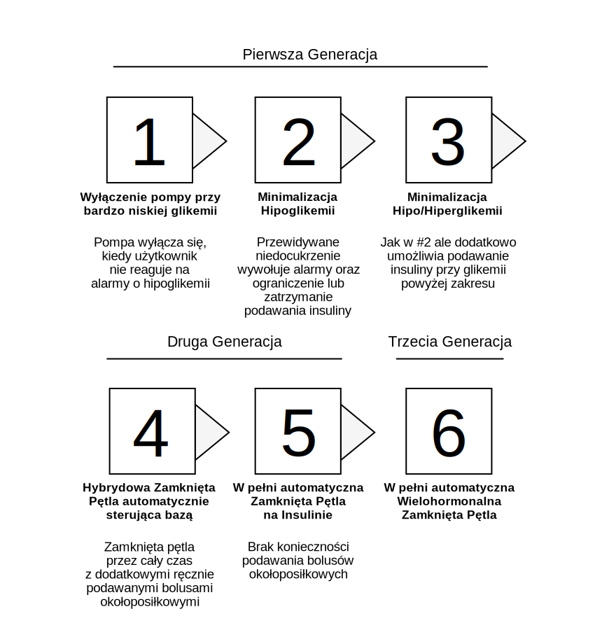
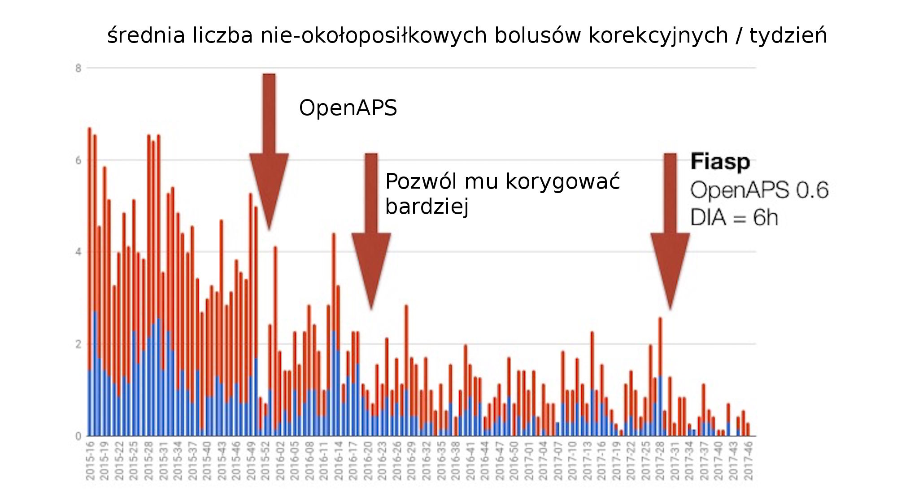
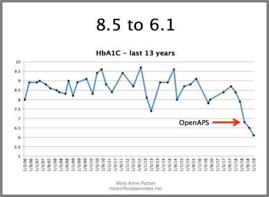
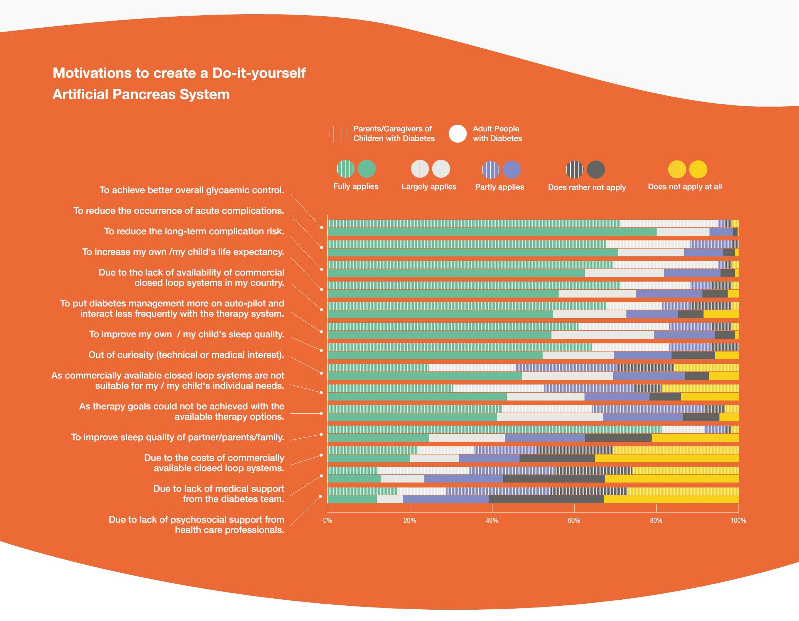

# 1. Czym jest zamknięta pętla lub sztuczna trzustka i czemu ktoś chciałby jej używać?

## Różne nazwy dla tej samej technologii

Spotkasz się z różnymi nazwami i terminami opisującymi ten sam ogólny typ technologii. _Sztuczna trzustka_ \(ang.: artificial pancrea_s_, **AP**\) lub _system sztucznej trzustki_ \(ang.: artificial pancreas system, **APS**\) jest jedną z tych nazw. _Pętla_ to skrótowa nazwa od _zamkniętej pętli_ \(choć równie dobrze może się odnosić do ‘otwartej’ pętli\). Amerykańska agencja odpowiedzialna za regulację rynku żywności i leków, FDA, podobnie jak wiele innych podmiotów i duża część literatury medycznej, nazwie to systemem _automatycznego dostarczania insuliny_ \(ang.: automated insulin delivery, **AID** system\). Niektórzy mówią o "hybrydowej" lub "w pełni automatycznej" zamkniętej pętli. A dla odróżnienia systemów wykonanych samodzielnie od tych komercyjnych, w przypadku tych pierwszych spotkasz się z przedrostkiem **DIY**, od angielskiego "do-it-yourself" czyli "zrób to sam".

Aby lepiej zrozumieć różne ze spotykanych nazw i niuanse w nich zawarte, prześledźmy etapy rozwoju tej technologii. Pomoże nam w tym diagram opracowany przed laty przez fundację JDRF:

* **Etap 1:** zawieszenie przy niskiej glikemii. Kiedy twoja glikemia spada poniżej ustalonej dolnej granicy, podawanie insuliny jest zredukowane lub zawieszone.
* **Etap 2:** predykcyjne zawieszenie przy niskiej glikemii. Kiedy przewidywane jest, że w niedalekiej przyszłości twoja glikemia spadnie poniżej ustalonej dolnej granicy, podawanie insuliny jest zredukowane lub zawieszone.
* **Etap 3:** hybrydowa zamknięta pętla. Kiedy przewidywane jest, że w niedalekiej przyszłości twoja glikemia spadnie poniżej ustalonej dolnej granicy, podawanie insuliny jest zredukowane lub zawieszone. Dodatkowo, kiedy system przewiduje wzrost glikemii powyżej górnej granicy, spowoduje zwiększenie ilości podawanej insuliny.
* **Etap 4:** także hybrydowa zamknięta pętla.
* **Etap 5:** w pełni automatyczna zamknięta pętla. Nie trzeba ręcznie podawać bolusów na posiłek.
* **Etap 6:** w pełni automatyczna zamknięta pętla korzystająca z wielu hormonów.

Jak zapewne się domyślasz, ten schemat rozwoju zaproponowano ponad dekadę temu. \(W zespole JDRF zaczęto rozmawiać o pomyśle i finansowaniu _Projektu Sztucznej Trzustki,_ Artificial Pancreas Project w 2006\). Obecnie, etapy 3 & 4 są w zasadzie tym samym, traktowane jako standard "hybrydowych" zamkniętych pętli, oraz stanowią podstawę bieżąco implementowanych komercyjnych systemów zamkniętej pętli, które w najbliższych latach zadebiutują na rynku.

Jednakże, czy uwierzysz że etap 5 - czyli ‘w pełni automatyczna‘ zamknięta pętla - jest już teraz rzeczywistością dla niektórych w świecie samodzielnie wykonywanych systemów zamkniętej pętli?

## Gdybyś mógł wybrać choć jedną rzecz, co chciałbyś móc odpuścić?

Spośród rzeczy, które musisz robić dzisiaj \(w związku z codziennym leczeniem cukrzycy, a w szczególności dozowaniem insuliny\) co chciałbyś móc odpuścić, i nie musieć już robić - gdyby to było tylko możliwe? Liczenia węglowodanów? Podawania bolusów? Lub – w przypadku wyników – co gdybyś mógł zapobiec spadkom glikemii po posiłku? Lub zredukować wysokość pików glikemii?

**Jak myślisz, ile z poniższych pięciu rzeczy można osiągnąć jednocześnie?**

* Brak konieczności podawania bolusa
* Brak konieczności liczenia węglowodanów 
* Posiłki ze średnią lub wysoką ilością węglowodanów
* Glikemia 80%+ czasu w zakresie
* Brak hipoglikemii

Ile z tego możesz osiągnąć jednocześnie dzięki twojej bieżącej terapii i wybieranym dotychczas narzędziom? Jak myślisz - które z tych celów można jednocześnie osiągnąć dzięki systemowi hybrydowej zamkniętej pętli?

Na samej pompie i CGM-ie, jest możliwe mieć dobry czas glikemii w zakresie, o ile dobrze zsynchronizujesz bolusy z posiłkami, policzysz węglowodany, i oprzesz dietę o posiłki z niską zawartością węglowodanów \(lub będziesz mieć szczęście / poświęcisz dużo czasu na naukę kiedy dokładnie podawać insulinę do standardowych posiłków\). A nawet pomimo tych starań, niektórzy nadal doświadczą spadków i hipoglikemii. Więc powiedzmy że osiągnęliśmy **2 z 5** możliwych do osiągnięcia jednocześnie celów.

Wraz z pierwszą generacją systemów hybrydowej zamkniętej pętli które pojawiły się w społeczności DIY, jak pierwotny algorytm oref0 projektu OpenAPS \(mający premierę w 2015\), możliwe jest osiągnięcie dobrego czasu w zakresie w nocy, ale aby osiągnąć to także za dnia, w trakcie posiłków, nadal wymagane jest liczenie węglowodanów i podawanie bolusów. Ale oprócz perfekcyjnej glikemii w nocy możliwe jest jednoczesne wyeliminowanie niedocukrzeń, utrzymanie glikemii w zakresie przez 80% czasu przy spożywaniu średnio bogatych w węglowodany posiłków \(a nawet przy bogatych w węglowodany korzystając z narzędzia  "Wkrótce posiłek" i innych taktyk\). Powiedzmy więc że mamy **3 z 5**.

Jednakże na początku 2017 zaczęliśmy dyskutować jak udoskonalić osiągane wyniki, w tym zastanawialiśmy się nad lepszym reagowaniem na nieuwzględnione posiłki. Czyli sytuacje gdy ktoś je i podaje bolusa ale nie wprowadził ilości węglowodanów do systemu. \(Lub w niektórych przypadkach: je ale nie odnotuje węglowodanów i nawet nie poda bolusa\). Jak zaprojektować schematy działania lepiej radzące sobie w takich sytuacjach, które jednocześnie nadal konsekwentnie podążają za naszymi zasadami bezpieczeństwa, w szczególności w kontekście dawkowania insuliny.

Aby lepiej pomóc w takich sytuacjach, zaprojektowaliśmy nowe komponenty w używanych algorytmach \(w tym sposób na "super mikro bolusy" oraz bezpieczne "przesuwanie w przyszłość" aktywnej insuliny poprzez "pożyczanie" jej z bazy która ma dopiero zostać wkrótce podana\).

Dzięki włączeniu tych funkcji, jest możliwe osiągnięcie solidnych **4 z 5**. I to nie tylko konkretnie wybranego zestawu 4 celów, ale **dowolnej konfiguracji 4 z dostępnych 5** \(poza tym że, oczywiście, wolelibyśmy aby tym pozostałym jednym nigdy nie okazał się brak hipoglikemii\):

* Przy diecie nisko-węglowodanowej, brak niedocukrzeń i 80+% czasu w zakresie możesz osiągnąć bez ręcznego podawania bolusów i liczenia węglowodanów.
* Jedząc standardowe posiłki, możesz podawać bolusy lub zgrubnie liczyć węglowodany lub uprzedzać system o posiłku wkrótce i osiągać glikemię w zakresie przez 80% czasu.
* Jeśli zdecydujesz jeść standardowe jedzenie bez podawania bolusów i nie licząc węglowodanów, twoje poziomy glikemii nie będą tak dobre, ale system i tak da z siebie wszystko aby ratować sytuację i zbijać glikemię do zakresu dbając aby nie doprowadzić przy tym do niedocukrzeń lub długotrwałych hiperglikemii.

To oczywiście ogromy postęp. Uważamy że jesteśmy blisko granicy tego, co można osiągnąć używając bieżącej generacji terapii pompowej na bazie samej insuliny. Aby osiągać jeszcze lepsze efekty potrzebowalibyśmy już albo: dozować glukagon przy konfiguracji na bardziej wyśrubowane cele, albo dużo szybszej insuliny. Bieżąco opracowywane systemy dwu-hormonalne celują w średnią glikemię 140 mg/dL, lub hemoglobinę glikowaną \(HbA1c\) 6.5%, co prawdopodobnie oznacza ponad 20% czasu spędzonego powyżej 160 mg/dL. I aby to osiągnąć takie systemy i tak potrzebują zapowiedzi posiłków i szacowania ich rozmiaru.

Insulina Fiasp jest obiecująca jeśli chodzi front szybszych insulin, jej użycie pozwala niektórym użytkownikom nie zapowiadać i nie podawać bolusów do posiłku, ale prawdopodobnie nie jest dostatecznie szybka aby pomóc uzyskać jednocześnie 80% czasu w zakresie na wysoko-węglowodanowej diecie przy braku bolusów i zapowiedzi posiłków. Jednak, 4 z 5 to całkiem nieźle, szczególnie jeśli możesz wybrać które 4, a w dodatku praktycznie zmieniać ten wybór przy każdym kolejnym posiłku. To właśnie osiągamy z samodzielnie zbudowaną hybrydową zamkniętą pętlą \(DIY APS\), która w praktyce jest systemem drugiej generacji - i mamy nadzieję \(oraz oczekujemy\) że ten sam rodzaj elastyczności co do wyborów i osiąganych rezultatów będzie możliwy także w przypadku komercyjnych systemów drugiej generacji.

## Jak działa APS

Niezależnie od czego czy mówimy o systemach DIY czy komercyjnych, hybrydowych czy w pełni automatycznych, w najbardziej podstawowym zakresie wszystkie one opierają swoje działanie na tych samych zasadach.

Ten typ technologii dokonuje drobnych korekt co kilka minut aby dozować więcej lub mniej insuliny, tak aby utrzymywać glikemię \(poziom cukru we krwi, z ang.: blood glucose, **BG**\) w ustalonym z góry zakresie docelowym. W tym celu korzysta z następujących komponentów: osobistej pompy insulinowej, ciągłego monitora glikemii \(z ang.: continuous glucose monitor, **CGM**\) oraz kontrolera. 

W "ręcznym" trybie zarządzania cukrzycą, ty jako człowiek jesteś kontrolerem. Sam odczytujesz informacje z pompy i CGM-a, wykonujesz pewne obliczenia w pamięci po czym decydujesz co robić. I robisz to na okrągło, cały dzień, każdego dnia.

W trybie "automatycznym", to komputer pełni funkcje kontrolera w centrum systemu. On odczytuje stan pompy i CGM-a, dokonuje obliczeń na bazie konfiguracji, przewiduje co może się wydarzyć i zmienia dozowanie insuliny tak, aby wpłynąć na prognozowaną glikemię w oczekiwany sposób.

Komputer sprawdza się znacznie lepiej w roli "kontrolera" niż my, ludzie. My ludzie mamy życie do przeżycia, pracę do wykonania, potrzebujemy spać itd. Przez to nawet najbardziej sumienny i uważny człowiek czasami będzie potrzebował przerwy lub zajmie się czymś innym, i nie będzie w stanie nieustannie śledzić glikemii. Z drugiej strony komputer może być zaprogramowany aby oczekiwać na każdy nadchodzący wynik i poziom cukru, co pięć minut, i za każdym razem przeliczyć i zareagować korektami.

Kolejnym powodem dla którego komputer działa tak dobrze w systemach zamkniętej pętli jest fakt, że cukrzyca jest skomplikowana i na jej przebieg wpływa wiele niedających się łatwo uwzględnić czynników na które trzeba reagować - ale nie zawsze możemy dokładnie je śledzić i przeliczyć. Na przykład: stres i adrenalina oraz podekscytowanie może wpływać na twój poziom cukru, tak jak ilość i rodzaj aktywności fizycznej i ćwiczenia. Czasami te czynniki sprawią, że twoja glikemia wzrośnie, a przy innej okazji - że spadnie. Czasami będzie to natychmiastowe, a kiedy indziej objawi się po kilku godzinach. Trudno samemu to przewidzieć i zaplanować oraz korygować ręcznie. Okazuje się że lepiej jest czekać i obserwować co się dzieje, dokonując nieustannych poprawek, ale my ludzie nie mamy na to dość czasu i cierpliwości.

Dodatkowo insulina nie działa natychmiastowo. Współczesne "szybko" działające insuliny mają szczyt działania po 60-90 minutach od podania, ale "ogon" ich aktywności rozciąga się i wpływa na twój organizm jeszcze przez 6 do 8 godzin. To może być trudne do śledzenia. Kalkulatory bolusów we współczesnych pompach próbują jakoś sobie radzić z tym problemem, ale nie biorą pod uwagę innych zawirowań jak: tymczasowe zmiany dawek bazowych które wpłynęły na ilość faktycznie podanej insuliny lub czas wyłączenia pompy \(bo pływałeś na basenie lub brałeś prysznic\). Nauczenie komputera aby śledził krzywe aktywności insuliny i uwzględniał wpływ jaki będą miały każde zmiany bazy, każde przerwy i wszystkie bolusy \(w stosunku do tego, co było by normą dla twojego organizmu\) - jest dużo prostsze niż gdybyśmy mielibyśmy to robić nieustannie my, ludzie.

Innymi słowy, cukrzyca jest trudna. Jest nieustępliwa. Jest nieubłagana. Komputer będzie nieustannie i uważnie czuwał, i w większości przypadków będzie w stanie zareagować szybciej od człowieka na fluktuacje poziomu glukozy we krwi. A jeśli nie będzie w stanie zareagować dostatecznie w ekstremalnych sytuacjach, można zaprogramować go w ten sposób, aby powiadomił cię o konieczności podania insuliny lub spożycia węglowodanów.

Poszczególne systemy zamkniętej pętli wymagają różnego poziomu interakcji z twojej strony. W zależności od osobistych celów i preferencji, może to wpływać na typ czy markę wybranego systemu, oraz z czasem wpłynie na sposób w jaki będziesz użytkował system.

## Analogie ułatwiające zrozumienie wpływu systemu APS na życie z Cukrzycą typu 1

### _Noworodek_

Kiedy próbuję opisać wpływ systemu APS ludziom którzy nie mają zbyt dogłębnej wiedzy o cukrzycy typu 1, zaczynam od pomocy im w lepszym zrozumieniu czym jest cukrzyca typu 1 sama w sobie. I nie chodzi tu tylko o "trzustka nie produkuje już insuliny", ale o lepsze zrozumienie jak wygląda życie z cukrzycą typu 1. Oznacza to przedstawienie, na przykładzie analogii, ile cukrzyca pochłania energii i jak zaburza codzienne życie. Oczywiście nie zawsze, ale może.

Najlepszą analogią którą znalazłam, a która jest czytelna i pozwala wczuć się w sytuację wielu rozmówcom, jest analogia do noworodka lub małego dziecka. Małe dzieci wymagają opieki, karmienia, noszenia itd. co kilka godzin. I nie ma znaczenia czy jesteś zmęczony, chcesz spać: dziecko obudzi cię płaczem tak abyś zająć się jego potrzebami. Czasami okaże się że problem da się rozwiązać używając pewniaków: nakarmisz je i pójdzie spać. Zmienisz pieluszkę i pójdzie spać. Ale czasami będziesz zachodził w głowę, bo nic nie działa, nic nie pomaga, dziecko nie przestaje płakać, a ty nie możesz po prostu pójść spać dalej. Nawet gdy jest to "dobra" noc, nadal zostaniesz obudzony w jej środku. Jesteś notorycznie niewyspany i wyczerpany.

Z cukrzycą typu 1 jest jak z noworodkiem który nigdy, przenigdy nie dorośnie. W środku nocy twój poziom cukru we krwi może spaść. Może to być spowodowane wieloma czynnikami, na przykład ćwiczeniami poprzedniego dnia. Twój cukier we krwi może też wzrosnąć, na przykład z powodu leniwego wchłaniania węglowodanów lub tej kolacji późnym wieczorem. Może to być wynik fizjologicznego uwolnienia hormonów, tzw.: fenomenu brzasku, lub hormonów wzrostu. Może być to też spowodowane cyklem menstruacyjnym, objaw zbliżającego się okresu. Z wielu powodów twoja glikemia może znaleźć się poza zakresem, i może cię obudzić - dzięki alarmom systemu CGM lub po prostu z powodów samych symptomy wysokiej lub niskiej glikemii. Może będziesz musiał przerwać sen aby rozpoznać i przeanalizować sytuację. To może być szybka korekta, ale może okazać się że musisz pozostać na nogach dłużej i odczekać aż poziom cukru we krwi się ustabilizuje. I nie ma lekarstwa na cukrzycę typu 1, więc od momentu diagnozy jest to codzienna rzeczywistość z którą przychodzi się zmierzyć.

Z systemem APS jest jak z posiadaniem "nocnej niani" dla cukrzycy. Kiedy twoja glikemia zaczyna rosnąć lub opadać, APS zareaguje i zrobi wszystko co w jego mocy aby rozwiązać problem za ciebie. Pewnie zdarzy się że nadal będzie musiał cię obudzić alarmem - ale nie będzie to pobudka kilka razy w tygodniu lub nawet tej samej nocy jak dotychczas, a jeden przypadek na miesiąc lub pół roku. Różnica potrafi być kolosalna - a mówimy tu tylko o aspekcie przesypiania nocy w kontekście życia z cukrzycą typu 1!

### _Teoria Łyżek_

Inną analogią która daje do myślenia i oddziałuje na wyobraźnię jest "Teoria Łyżek". To koncepcja używana w środowisku osób przewlekłe chorych, pozwalająca zobrazować jak zaskakująco wiele energii i pracy mogą wymagać nawet najprostsze czynności dnia codziennego, kiedy musisz łączyć je z przewlekłą chorobą. Termin ten ukuła i opisała Christine Miserandino \([tu możesz przeczytać oryginalny esej po angielsku](https://butyoudontlooksick.com/articles/written-by-christine/the-spoon-theory/)\).

> na polski przetłumaczyła i odniosła się do niego [Kinga na swoim blogu](https://denochkinga.blogspot.com/2018/05/dworcowa-awka-ratujaca-zycie-i-teoria.html)   
> \(_przyp. tłum\)_

Wyobraź to sobie tak: na każdy standardowy dzień dostajesz pięć "łyżek". Jeśli dzień jest dobry, będziesz potrzebować jednej łyżki energii aby ogarnąć wszystkie tematy związane z cukrzycą. Zostanie ci wtedy jedna łyżka aby pójść na siłownię i poćwiczyć, łyżka na pracę, łyżka na zabawę ze swoimi dziećmi i jeszcze łyżka którą możesz przeznaczyć na cokolwiek innego. Ale następnego dnia dwa razy w środku nocy budziły cię alarmy o hipoglikemii, co kosztowało cię dwie łyżki na start i zostawiło z trzema łyżkami na resztę dnia. Jeśli to typowy dzień, może się uda i będzie OK. Ale co jeśli akurat w tym dniu będziesz potrzebować dwóch łyżek w pracy lub twoje dzieci będą wymagały więcej uwagi? To może nie tylko utrudnić ci wyrobienie się z wszystkim, ale nawet uniemożliwić "normalne" funkcjonowanie w typowy dzień.

Możesz także spróbować myśleć o tym w kategoriach walutowych. Co gdybyś miał 10zł codziennie do wydania na rzeczy które kochasz robisz. A co jeśli z tej kwoty 4zł "kosztuje" cię cukrzyca? Jeśli APS pozwoli ci wydać mniej na cukrzycę i odzyskać 3zł, na co mógłbyś je przeznaczyć? Co mógłbyś zrobić z tym odzyskanym czasem, energią i lepszym zdrowiem?

## Dlaczego ludzie decydują się na używanie APS

Jest wiele powodów dla których ludzie decydują się na używanie systemu sztucznej trzustki.

Moim powodem, jak to wskazałam w przedmowie, jest sen. Chcę móc wyspać się bezpiecznie i bez obaw. Nie ma nic lepszego dla mnie jak długa \(powiedzmy że 10-12 godzinna\) przespana noc z poziomami cukru we krwi pozostającymi w zakresie przez cały ten czas. Niektórzy  są w stanie osiągnąć to przy terapii na penach przy wielu iniekcjach lub na samej pompie. Mi nie udawało się osiągnąć tego konsekwentnie i powtarzalnie, ze względu na mój zmienny tryb życia. Cenię sobie też bezpieczeństwo, jakie daje system który dzień i w nocy reaguje na fluktuacje glikemii pojawiające się z jakichkolwiek powodów. 

To nie jedyny powód dla którego ludzie wybierają technologię APS. Niektórzy decydują się bo mogą osiągnąć te same cele \(HbA1c\) przy dużo mniejszym nakładzie pracy. Sulka Haro i jego rodzina zrobili kawał dobry roboty dla zobrazowania tego efektu, ponieważ byli w stanie przejrzeć dzienniki i podliczyć ile akcji związanych z leczeniem podejmowali dziennie w związku z cukrzycą typu 1 ich syna. Przed wdrożeniem systemu OpenAPS, dziennie dokonywali średnio 4.5 ręcznych korekt dozowania insuliny dziennie. \(Czy możesz wyobrazić sobie ile kosztuje wysiłku uganianie się za małym brzdącem cały dzień i proszenie aby zjadł coś, kiedy nie ma na to ochoty, lub nie wiercił się na krótką chwilę kiedy ustawiasz bolus na pompie?\). I ta liczba nie uwzględnia rutynowych akcji jak podawanie bolusów do posiłku czy korekcyjne dosładzanie. A po przejściu na OpenAPS, wybraniu preferowanych przez nich funkcjonalności i - z czasem - skonfigurowaniu algorytmu? Obecnie dokonują mniej niż jednej manualnej korekty insuliny na dzień. To olbrzymia redukcja nakładu pracy jaką muszą włożyć, przy osiąganiu tych samych wyników HbA1c co wcześniej.

Kolejną historią wartą przytoczenia jest historia rodziny Wittmer. Jason Wittmer zbudował zestaw OpenAPS dla swojego syna. Katie Wittmer natomiast pracowała w instytucji będącej odpowiednikiem  wojewódzkiego kuratorium oświaty, przez co miała dostęp do danych o ilości wizyt jej syna u szkolnej pielęgniarki. W 4-tej klasie, przed OpenAPS, musiał odwiedzać gabinet szkolnej pielęgniarki - opuszczając w tym czasie zajęcia lekcyjne i rówieśników - 420 razy w roku szkolnym. To daje średnio 2-3 wizyty na dzień. 354 z tych wizyt były "rutynowe", w związku z kontrolą przed obiadem lub przed WF-em. 66 wizyt miało związek z hipo- lub hiperglikemią. Porównajmy to z doświadczeniami z 6-tej klasy: odwiedził szkolną pielęgniarkę jedynie pięć razy \(trzy wizyty miały związek z hipoglikemiami w trakcie zajęć sportowych, dwie były związane z usterkami CGM-u lub gdy potrzebował pomocy przy rozwiązaniu problemu z zestawem OpenAPS\).

Podstawową motywacją dla większości ludzi używających systemu APS w wykonaniu DIY jest poprawa kontroli glikemii, i czasami postępy na tym polu mogą być spektakularne.

Mary Anne Patton opisuje swoje doświadczenia z przejściem na OpenAPS po 38 latach życia z cukrzycą typu 1 na swoim blogu, [myartificialpancreas.net](http://myartificialpancreas.net). Mówi, że OpenAPS dał jej narzędzia, aby po raz pierwszy zobaczyć jak jej wysoka wrażliwość na insulinę i zmienność glikemii doprowadziły ją do rozwinięcia zachowań kompensacyjnych aby unikać hipoglikemii, co miało wpływ na jej kontrolę glikemii. Naniosła wyniki badań HbA1c z ostatnich 13 lat w formie wykresu, na którym zaznaczyła kiedy rozpoczęła korzystanie z systemu APS DIY.

Jednych z lepszych przeglądów motywacji którymi kierują się ludzie decydujący się na system DIY \(który prawdopodobnie będzie zbliżony do powodów z których ludzie wybierają analogiczne systemy komercyjne\), pochodzi z [badania](https://open-diabetes.eu/en/research/diwhy/) przeprowadzonego wśród społeczności DIY, za pośrednictwem inicjatywy badawczej OPEN, której jestem częścią. Jest to fundowana z grantów inicjatywa mająca na celu badanie przestrzeni diabetologii open source.

> open source - z ang.: otwarte źródło, co oznacza takie oprogramowanie którego kod źródłowy, dokumentacja i sposób działania jest publicznie dostępny, za darmo i zazwyczaj rozwijany przez grupę ochotników z całego świata  
> \(_przyp. tłum\)_

Wyniki ankiety zaprezentowano na konferencji ATTD 2019. Niektóre z najwyżej pojawiających się motywacji dotyczyły zapobiegania i redukcji krótko o długoterminowych komplikacji około-cukrzycowych. Doceniam tę ankietę ponieważ umożliwiła także rozróżnienie i porównanie motywacji w zależności czy jesteśmy w grupie \(dorosłych\) chorujących na cukrzycę typu pierwszego czy też opiekunów chorych \(rodziców i/lub partnerów\). Dla tych drugich, ich własny spokojny sen jest zazwyczaj głównym motywatorem skłaniającym do wyboru systemu APS.

Ostatecznie może nie mieć absolutnie żadnego znaczenia jakie są motywacje innych ludzi. Każdy z nas jest inny: nasza cukrzyca jest inna. Nasz styl życia jest inny. Nasze cele, wybory, preferencje są inne. Ostatecznie jest to więc osobista decyzja - czy chcesz używać systemu klasy APS, oraz który z dostępnych jego wariantów wybierzesz.

